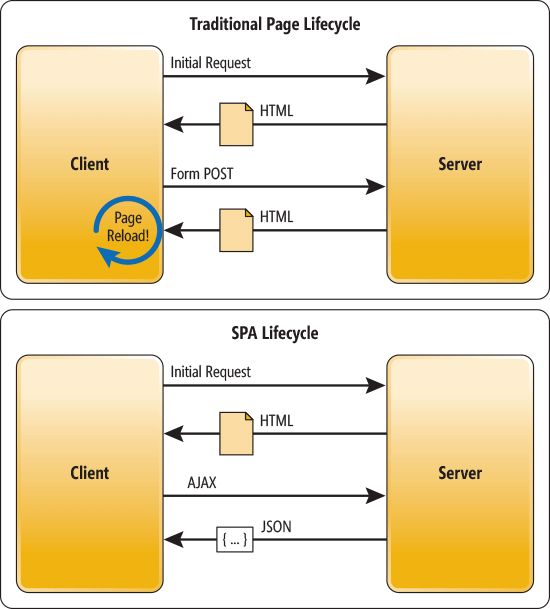
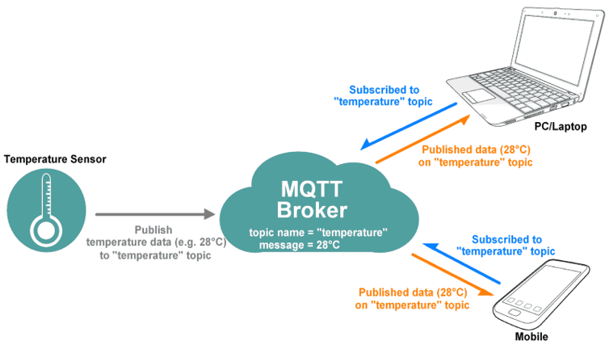
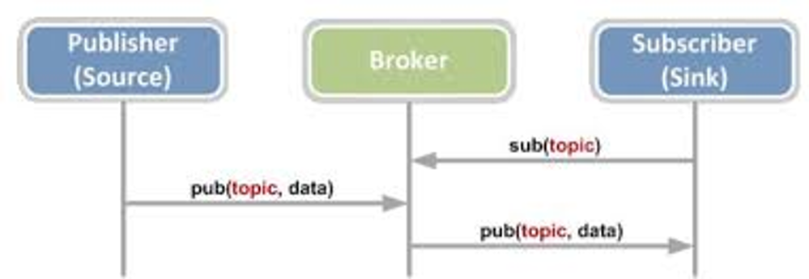

# simple-mqtt-esp32-object-IoTFramework

### **Single Page Application (SPA)**

Una SPA è sostanzialmente un'applicazione web (WEB app)  cioè un sito web che può essere usato o consultato su una singola pagina web con l'obiettivo di fornire una esperienza utente più fluida e simile alle applicazioni desktop dei sistemi operativi tradizionali. 

La pagina della web app è divisa sostanzialmente in **due parti** non necessariamente contigue:
- **sezioni statiche** comuni a tutti i contenuti che vengono caricate da un **server web** con una normale **richiesta HTTP** (POST o GET) e sono composte da codice HTML, CSS e javascript statico. Costituiscono il **layout di base** della pagina.
- **sezioni dinamiche** specifiche i cui contenuti possono essere caricati da server diversi con **protocolli eterogenei** ed **assemblati localmente** dal client nel layout statico della pagina. Per recuperare i contenuti sono comuni richieste **HTTP** dinamiche in tecnologia **AJAX** (e suoi derivati quali JQUERY e Angular) ma anche richieste **MQTT** e **COAP**.

Spesso le **WebApp** sono assimilabili alle tradizionali **applicazioni distribuite** desktop in virtù della **bidirezionalità del canale** tra le due componenti client e server. Nelle **applicazioni desktop** il **canale bidirezionale** è (a basso livello) basato sulle API standard dei **socket BSD**. Nella applicazioni web app il canale bidirezionale è ormai quasi sempre realizzato con le **API websocket** e raramente ormai con tecniche di **long polling** del server.

 
 
Il **ciclo di vita** di una SPA tipicamente consiste in:
1) **Richiesta iniziale** del layout comune statico
2) **acquisizione degli input** utente mediante caselle di testo o pulsanti solitamente, in ambito SPA, gestiti tramite **ascoltatori di eventi** realizzati in javascript
3) **una o più richieste** dei contenuti specifici aventi come **parametri** gli input e veicolate via AJAX o MQTT o COAP (invece delle solite richieste POST dei form)
4) **interpretazione della risposta** in formato JSON o XML
5) **inserimento dei contenuti dinamici** nelle sezioni della pagina statica mediante codice lato client in javascript che modifica il **modello ad oggetti** della pagina (DOM) o **direttamente** mediante comandi di manipolazione della **rappresentazione ad oggetti** degli elementi HTML (getElementById() e appendChild()) o **indirettamente** mediante iniezione con document.write() **di tag html e istruzioni CSS** dinamici che si sovrappongono a quelli statici del layout.

Il **modello di applicazione** proposto nel **progetto** consiste in un una **costellazione di dispositivi** IOT dotati di client MQTT per operazioni di **pubblicazione** e **notifica** di contenuti e in un **server centrale** con funzione di **server web** per le pagine statiche delle web app e con funzione di **broker MQTT** per lo **smistamento** delle comunicazioni reciproche tra dispositivi IOT e tra dispositivi IOT e web apps.

### **Broker MQTT**

MQTT Fornisce un **canale multicast** di livello applicativo (L7) tramite cui un utente col ruolo di publisher è in grado di notificare una replica dello stesso messaggio a più subscribers.

Il canale multicast è realizzato da un dispositivo intermedio detto **broker** che realizza un routing di livello applicativo (L7) delle informazioni, smistandole in base ad una **etichetta** di destinazione detta **topic**.

L’**indirizzamento** fisico dei dispositivi può essere o solo L2 (MAC) o sia L2 che L3 (IP) ma è **implicito** e noto solo al broker. I client per inviare un messaggio non sono tenuti a conoscere l’indirizzo fisico degli altri interlocutori ma solo quello del **broker** ed il **topic**. 

Gli utenti si comportano tutti come **client** poiché sono loro che **iniziano la connessione** con il broker e non il viceversa, ma si dividono in **due ruoli**:
- **PUBLISHER** coloro che inviano le informazioni. Un publisher deve solo connettersi, **decidere il topic** e **inviare** l’informazione.
- **SUBSCRIBERS** coloro che ricevono le informazioni. Un subscriber deve preventivamente **registrarsi** ad uno o più topic presso il server affinchè possa **ricevere** l’informazione quando questa verrà pubblicata.

### **Fasi MQTT**

Le **fasi** scambio delle informazioni via MQTT tipicamente sono:
1) Il **Subscriber** dichiara presso il broker il proprio interesse a ricevere notifiche riguardo ad un certo argomento (topic)
2) il **publisher** pubblica un messaggio che riguarda un certo topic
3) Il **broker** inoltra il messaggio a tutti i subscriber interessati al suo topic

[Realizzazione SPA di comando](spa.md)

[Realizazione Gateway MQTT](gateway.md)

