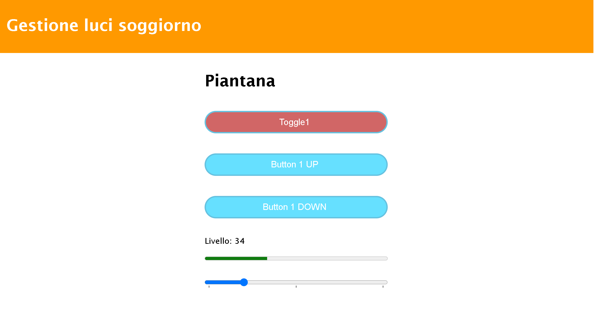

>[Torna all'indice generale](../README.md)

# **COMANDO DIMMERED TOGGLE**

Si tratta di uno pulsante **toggle** con **fading automatico** dei valori di uscita dato che, in questo dispositivo, non vengono impostati immediatamente tra un **valore iniziale** ad uno **finale** ma assumono un certo numero di **valori intermedi** compresi tra quelli estremi con un **andamento progressivo nel tempo**. 

L'**andamento temporale** è, in questo caso, **lineare** ed calcolato in proporzione ai punti compresi tra i due valori iniziale e finale. Il valore di **tempo massimo** è relatico all'escursione massima tra il livello ```0``` e quello ```100```.

Lo **scivolamento** (sweep) dei valori avviene sempre tra **due estremi** (il primo è zero) per realizzare **due funzioni** diverse:
- il **toggle con fading automatico** cioé lo scivolamento tra il **valore ```0```** e un **valore preimpostato** e viceversa.
- l'**impostazione manuale** del tetto del fading, cioè del suo valore superiore. Avviene essa stessa con fading, cioè con uno scivolamento progressivo dei valori che però è **iniziato**, in un certo verso, con la **pressione** di uno dei due pulsante (UP o DOWN) ed è **terminato** con la **pressione** di uno qualsiasi dei due pulsanti (UP o DOWN) dello stesso gruppo.

### **Utilizzo**

La pagina ha **2 pulsanti (UP e down)**, **1 barra di stato**, **1 slider** divisi in **2 gruppi**. Un gruppo comanda l'impostazione del livello di una singola uscita. Le uscite **non** sono direttamente **impostate** dalla libreria perchè sono lasciate volutamente **generiche** in quanto potrebbero attivare, a seconda dei casi, una porta digitale, un comando MODBUS, un comando sulla seriale, ecc.


**Fasi**:
1. **Trascinando** lo **slider** l'uscita viene impostata ad un valore compreso tra ```0``` e ```100```. Il valore però non viene inviato al dispositivo durante il trascinamento ma solamente dopo che il cursore si è fermato ed il click del mouse è stato rilasciato. Lo slider imposta la velocità del **fading** che può variare da istantanea (assenza di fading) ad un valore minimo che dipende dal tempo massimo impostato al momento dell'intanzizione degli oggetti.
2. premendo uno dei **pulsanti** UP e DOWN si entra nella **modalità di impostazione** della **profondità fading**, cioè del **valore massimo** ell'uscita. L'impostazione avviene **visivamente** osservando la progressione del fading nella barra di stato oppure osservando l'effetto sul dispositivo comandato (ad esempio una lampada dimmerabile). 
3. Quando si ritiene che il livello (della barra o dell'effetto dell'uscita) è quello desiderato si **ripreme un pulsante qualsiasi** ottenendo insieme il **blocco** della progressione, la **memorizzazione** del livello raggiunto e l'uscita dalla modalità di impostazione e l'ingresso in quella di **controllo**.
4. da questo momento una pressione del pulsante **toggle** determina l'**accensione** o lo **spegimento** con **fading** di un dispositivo.
5. in modalità **controllo** è sempre possibile impostare la velocità del fading agendo sullo slider.


### **Layout pagina**

La **pagina** ```mqttupdown.html``` può essere caricata sul browser da una cartella sul PC o può essere caricata su un server web di pagine statiche.

Il **layout** è statico, responsivo, diviso in colonne ed è definito mediante il seguente CSS di **tipo GRID**:

```css
<style>
	.grid-container {
		display: grid;
		grid-template-columns: 1fr;
	}

	table {
		width: 100%;
	}

	@media only screen and (min-width: 600px) {
	  /* For tablets: */
	  .grid-container {
		  grid-template-columns: 1fr 1fr 1fr 1fr 1fr 1fr 1fr 1fr 1fr 1fr 1fr 1fr;
	  }
	  .col-s-1 {grid-column: span 1;}
	  .col-s-2 {grid-column: span 2;}
	  .col-s-3 {grid-column: span 3;}
	  .col-s-4 {grid-column: span 4;}
	  .col-s-5 {grid-column: span 5;}
	  .col-s-6 {grid-column: span 6;}
	  .col-s-7 {grid-column: span 7;}
	  .col-s-8 {grid-column: span 8;}
	  .col-s-9 {grid-column: span 9;}
	  .col-s-10 {grid-column: span 10;}
	  .col-s-11 {grid-column: span 11;}
	  .col-s-12 {grid-column: span 12;}
	}

	@media only screen and (min-width: 768px) {
	  /* For desktop: */
	  .grid-container {
		  grid-template-columns: 1fr 1fr 1fr 1fr 1fr 1fr 1fr 1fr 1fr 1fr 1fr 1fr;
	  }
	  .col-1 {grid-column: span 1;}
	  .col-2 {grid-column: span 2;}
	  .col-3 {grid-column: span 3;}
	  .col-4 {grid-column: span 4;}
	  .col-5 {grid-column: span 5;}
	  .col-6 {grid-column: span 6;}
	  .col-7 {grid-column: span 7;}
	  .col-8 {grid-column: span 8;}
	  .col-9 {grid-column: span 9;}
	  .col-10 {grid-column: span 10;}
	  .col-11 {grid-column: span 11;}
	  .col-12 {grid-column: span 12;}
	}
	.luci{
		border: 1px solid black;
	}
</style>
```



### **Struttura HTML**

La **pagina statica** ha tre sezioni una sotto l'altra:
- un **header** con il titolo e le informazioni comuni alla pagina da visualizzare per prima.
- un **corpo** organizzato mediante un layout a colonne responsive di tipo grid che contiene gli elementi HTML di **comando** con gli input e le informazioni di output.
- un **footer**. che contiene informazioni generali da visualizzare per ultime.

La definizione della **gerarchia di elementi** contenitori e contenuti del corpo dei comandi:

```html
<div class="header">
  <h1>Gestione luci soggiorno</h1>
</div>
<div class="grid-container">
	<div class="col-4 col-s-3 menu">
	</div>
	<div class="col-4 col-s-9 menu">
	 <h1>Piantana</h1>
	 <div id='form'>
		<form>
			<input id='to1' type='button' value='Toggle1' onmousedown='this.style.opacity="1"' onmouseup='this.style.opacity="0.6"' ontouchstart='this.style.opacity="1"' ontouchend='this.style.opacity="0.6"'>
			<br>
			<input id='on1' type='button' value='Button 1 UP' onmousedown='this.style.opacity="1"' onmouseup='this.style.opacity="0.6"' ontouchstart='this.style.opacity="1"' ontouchend='this.style.opacity="0.6"'>
			<br>
			<input id='off1' type='button' value='Button 1 DOWN' onmousedown='this.style.opacity="1"' onmouseup='this.style.opacity="0.6"' ontouchstart='this.style.opacity="1"' ontouchend='this.style.opacity="0.6"'>
			<br>
			<p>Livello: <span id='val1'></span></p>
			<meter id='pr1' min='0' max='100' style='width:100%; clear:both; margin:0 auto'>></meter>
			<br>
			<input type='range' min='0' max='100' value='50' list='tickmarks' class='slider' id='rng1'>
			<datalist id='tickmarks'>
				<option>0</option>
				<option>50</option>
				<option id='mid'></option>
				<option>100</option>
			</datalist>
			<br>
			<h1>Lampadario</h1>
			<input id='to2' type='button' value='Toggle2' onmousedown='this.style.opacity="1"' onmouseup='this.style.opacity="0.6"' ontouchstart='this.style.opacity="1"' ontouchend='this.style.opacity="0.6"'>
			<br>
			<input id='on2' type='button' value='Button 2 UP'  onmousedown='this.style.opacity="1"' onmouseup='this.style.opacity="0.6"' ontouchstart='this.style.opacity="1"' ontouchend='this.style.opacity="0.6"'>
			<br>
			<input id='off2' type='button' value='Button 2 DOWN' onmousedown='this.style.opacity="1"' onmouseup='this.style.opacity="0.6"' ontouchstart='this.style.opacity="1"' ontouchend='this.style.opacity="0.6"'>
			<br>
			<p>Livello: <span id='val2'></span></p>
			<meter id='pr2' min='0' max='100' style='width:100%; clear:both; margin:0 auto'>></meter>
			<br>
			<input type='range' min='0' max='100' value='50' list='tickmarks' class='slider' id='rng2'>
			<br>
		</form>
	 </div>
	</div>
	<div class="col-4 col-s-12">
	</div>
</div>
<div class="footer">
	  <p>Resize the browser window to see how the content respond to the resizing.</p>
</div>
```

### **Emulatore scivolamento valori nella pagina**

```javascript
function startPrgrBar(nstep,delay,tnow,n) {
	t[n]=tnow;//feedback tempo attuale barra
	//calcLen(tnow,maxtime[n],n);
	console.log('t[n]-testa:'+t[n]); 
	var tstep=0;
	var r;
	if(maxtime[n]>0){
		if(dir[n]!=0){
			if(t[n]<=0)t[n]=1;
			if(t[n]>0){
				tstep=maxtime[n]/nstep; //durata di uno step
				target_t[n] = target_p[n] /100*maxtime[n];
				console.log('target: '+target_t[n]+' tstep: '+tstep+' tmax: '+maxtime[n]+' dir: '+dir[n]+' tnow: '+tnow+' nstep: '+nstep+' n: '+n);
				clearInterval(updt[n]);
				updt[n]=setInterval(function(){
					if(stop[n]==false && (dir[n]>0 && t[n]<=target_t[n] || dir[n]<0 && t[n]>=target_t[n])){
						t[n]=t[n]+dir[n]*tstep;
						console.log('t:'+t[n]);					
						r = t[n]/maxtime[n]*100;
						calcLen(r,n);
						console.log('++++++++++++++');
						console.log('target: '+target_t[n]+' t:'+(t[n]-delay*dir[n])+' dir:'+dir[n]+' tmax:'+maxtime[n]+' n:'+n);
					}else{
						clearInterval(updt[n]);
						dir[n]=0;
						stop[n]=true;
					};
				},tstep);
				console.log('NEXT TO START//////////////////');
			};
		}else{
			console.log('t:'+t[n]);					
			r = t[n]/maxtime[n]*100;
			calcLen(r,n);
		}
	}else{
		dir[n]=0;
		stop[n]=true;
		r = t[n];
		console.log('calc speciale r:'+r); 
		calcLen(r,n);				
	}
	console.log('END START/////////////////////////////////');
};
function calcLen(r,n){			
	console.log('r: '+r);
	let aa=Math.round(r);
	console.log('aa: '+aa);
	if(isNaN(aa) || !isFinite(aa))pr[n].value=0; else pr[n].value=aa;
	return  r;
};
```

### **Formato JSON ingressi**

```C++
{"devid":"soggiorno-gruppo06","to2":"255"}	// Pressione toggle, vale sempre 255
{"devid":"soggiorno-gruppo06","on2":"255"}	// Pressione on, vale sempre 255
{"devid":"soggiorno-gruppo06","off2":"255"}	// Pressione down, vale sempre 255
{"devid":"soggiorno-gruppo06","sld2":"33"}	// Rilascio slider, vale un intero tra 0 e 100
```

### **Formato JSON feedback**

Il **dispositivo** invia almeno **due feedback**: uno **iniziale** con il quale parte l'evoluzione locale dell'uscita (sweep) ed uno **finale** con il quale si interrompe l'evoluzione. Il **feedback finale** porta con se anche il **valore vero finale** dell'uscita con il quale viene eventualmente corretto il valore **stimato localmente** dalla pagina. Il feedback ha quindi due funzioni: **sincronizzazione** di emulatore e dispositivo e **verifica** dello stato finale.

L'evento di rilascio di uno slider è l'unico senza feedback.

- ```on2```. ON Pulsante 2. Vale 255 se imposta un livello crescente dello sweep oppure vale il valore impostato se è premuto un TOGGLE.
- ```off2```. OFF pulsante 2. Vale 255 se imposta un livello decrescente dello sweep oppure vale ```0``` se è premuto un TOGGLE.
- ```to2```. TOGGLE pulsante 2. Vale ```1``` se è stato acceso, ```0``` se è in stato spento
- ```sp2```. Tempo massimo dello sweeo del gruppo 2 in msec.
- ```dr2```. Direzione dello sweep. Se è crescente vale ```1```, se è decrescente vale ```-1```, se deve fermarsi vale ```0```.
- ```tr2```. empo corrente da dove deve partire lo sweep espresso in msec.
- ```nl2```. Numero divisioni (valori delle uscite possibili) del gruppo 2.

```C++
//impostazione slider
{"devid":"soggiorno-gruppo06","sld2":"11"}
// sweep
{"devid":"soggiorno-gruppo06","on2":"255","off2":"0", "sp2":"10000","dr2":"1","tr2":"2704"}			//up sweep
{"devid":"soggiorno-gruppo06","on2":"0","off2":"0","dr2":"0","tr2":"4207"}					//stop sweep
//toggle on
{"devid":"soggiorno-gruppo06","on2":"42","off2":"0","to2":"1", "sp2":"1100","dr2":"1","nl2":"100","tr2":"1"} 	//toggle on start sweep
{"devid":"soggiorno-gruppo06","on2":"0","off2":"0","dr2":"0","tr2":"470"}					//toggle on stop sweep
//toggle off
{"devid":"soggiorno-gruppo06","on2":"0","off2":"0","to2":"0", "sp2":"1100","dr2":"-1","nl2":"100","tr2":"470"} 	//toggle off start sweep
{"devid":"soggiorno-gruppo06","on2":"0","off2":"0","dr2":"0","tr2":"-6"}					//toggle off stop sweep
//Ritrasm. periodica stato: 
{"devid":"soggiorno-gruppo06","on1":"0","off1":"0","to1":"0", "sp1":"10000","dr1":"0","nl1":"9","tr1":"0"}
{"devid":"soggiorno-gruppo06","on2":"0","off2":"0","to2":"0", "sp2":"1100","dr2":"0","nl2":"100","tr2":"-6"}

```

### **Callback uscite**

- ```outr```. Stato del pulsante in percentuale. Valore ```0``` o ```100``` 
- ```cr```. Stato del pulsante. Valore ```0``` o ```NLEVEL``` 
- ```n```. Numero del pulsante (inizia da 0).

```C++
void sweepAction1(int outr, int cr, uint8_t n){	
	Serial.println((String) "r: "+cr);
	if(cr > 0){
		Serial2.println((String)"@l"+cr);
		Serial.println((String)"@l"+cr);
	}else{
		Serial2.println((String)"@lo");
		Serial.println((String)"@lo");
	}
};
void sweepAction2(int outr, int cr, uint8_t n){	
	Serial.println((String) "r: "+cr);
	if(cr > 0){
		//Serial2.println((String)"@l"+cr);
		Serial.println((String)"@l"+cr);
	}else{
		//Serial2.println((String)"@lo");
		Serial.println((String)"@lo");
	}
};
```

### **Metodi di base comuni a tutti gli oggetti IOT**

- ```cmdParser(str,payload,"cmd",MAXLEN)```. Ricerca un certo commando ```cmd``` all’interno di una stringa e ne restituisce il valore sotto forma di stringa sul parametro di out str. Ritorna ```true``` se ha trovato un'occorenza del comando, ```false``` altrimenti.
- ```processCmd(String id, String payload)```. Elabora la richiesta remota interpretando la stringa json del messaggio in base al tipo di dispositivo IOT.

### **Metodi specifici di DimmeredToggle**

- ```DimmeredToggle(String id, uint8_t startIndex, uint8_t precision = 2, unsigned nlevel = 100, unsigned long maxtime = 10000)```. Costruttore. P1: devid univoco, P2: indice dispositivo nel gruppo (0,1,2,...), P3: precisione isteresi sweep, P4: numero di livelli da valorizzare, P5: durata massima sweep
- ```void remoteCntrlOn(uint8_t targetval)```
- ```void remoteCntrlOff(void)```
- ```void remoteSlider(uint8_t targetval)```
- ```void remoteToggle(uint8_t targetval)```. imposta il valore coorente dello slider. Valori da ```0``` a ```100```.
- ```void onAction(SweepCallbackSimple cb)```. Definisce la callback delle azioni esterne.

### **Struttura sketch Arduino**

Lo **sketch** ```mqtt-toggle.ino``` deve essere aperto con l'IDE di Arduino e caricato sul dispositivo ESP32 dopo aver selezionato correttamente la scheda e la porta della seriale e, chiaramente, dopo aver connesso il dispositivo alla porta usb del PC.

- ```id```. Nome univoco MQTT del dispositivo (uguale per tutti i pulsanti del gruppo.
- ```startIndex```. Nome univoco MQTT del dispositivo (uguale per tutti i pulsanti del gruppo.
- ```precision```. numero di livelli che definiscono l'intervallo di isteresi del blocco dello sscivolamento.
- ```nlevel```. Numero di livelli che valorizza lo slider.
- ```maxtime```. Tempo che impiega il controllo per raggiungere il massimo livello dello slider.

```C++
DimmeredToggle(String id, uint8_t startIndex, uint8_t precision = 2, unsigned nlevel = 100, unsigned long maxtime = 10000)
```


```C++
DimmeredToggle sw1(mqttid,0,SHARPNESS1,NLEVEL1,MAXT1);
DimmeredToggle sw2(mqttid,1,SHARPNESS2,NLEVEL2,MAXT2);

void setup() {
	sw1.onSweep(sweepAction1);
	sw2.onSweep(sweepAction2);
	sw1.onFeedback(feedbackAction);
	sw2.onFeedback(feedbackAction);
	.........................
	mqttClient.onMessage(messageReceived); 
}

void loop() {
	mqttClient.loop();
	//delay(10);  // <- fixes some issues with WiFi stability
	sw1.remoteCntrlEventsParser();
	sw2.remoteCntrlEventsParser();
	// schedulatore eventi dispositivo
	// pubblica lo stato dei pulsanti dopo un minuto
	if (millis() - lastMillis > STATEPERIOD) {
		lastMillis = millis();
		
		if(mqttClient.connected()){
			Serial.println("Ritrasm. periodica stato: ");
			sw1.remoteConf();
			sw2.remoteConf();
		}
	}
}

void feedbackAction(String buf){
	mqttClient.publish(outtopic, buf);
};
void sweepAction1(int outr, int cr, uint8_t n){	
	Serial.println((String) "r: "+cr);
	if(cr > 0){
		Serial2.println((String)"@l"+cr);
		Serial.println((String)"@l"+cr);
	}else{
		Serial2.println((String)"@lo");
		Serial.println((String)"@lo");
	}
};
void sweepAction2(int outr, int cr, uint8_t n){	
	Serial.println((String) "r: "+cr);
	if(cr > 0){
		//Serial2.println((String)"@l"+cr);
		Serial.println((String)"@l"+cr);
	}else{
		//Serial2.println((String)"@lo");
		Serial.println((String)"@lo");
	}
};
/////// gestore messaggi MQTT in ricezione (callback)     
void messageReceived(String &topic, String &payload) {
	void feedbackAction(String buf){
	mqttClient.publish(outtopic, buf);
};
void sweepAction1(int outr, int cr, uint8_t n){	
	Serial.println((String) "r: "+cr);
	if(cr > 0){
		Serial2.println((String)"@l"+cr);
		Serial.println((String)"@l"+cr);
	}else{
		Serial2.println((String)"@lo");
		Serial.println((String)"@lo");
	}
};
void sweepAction2(int outr, int cr, uint8_t n){	
	Serial.println((String) "r: "+cr);
	if(cr > 0){
		//Serial2.println((String)"@l"+cr);
		Serial.println((String)"@l"+cr);
	}else{
		//Serial2.println((String)"@lo");
		Serial.println((String)"@lo");
	}
};
/////// gestore messaggi MQTT in ricezione (callback)     
void messageReceived(String &topic, String &payload) {
	Serial.println("incoming: " + topic + " - " + payload);
	// Note: Do not use the client in the callback to publish, subscribe or
	// unsubscribe as it may cause deadlocks when other things arrive while
	// sending and receiving acknowledgments. Instead, change a global variable,
	// or push to a queue and handle it in the loop after calling `client.loop()`.
	
	//if(topic == intopic){
		//String str;	
		sw1.processCmd(mqttid, payload, MAXLEN);
		sw2.processCmd(mqttid, payload, MAXLEN);	
};
```

### **Callback MQTT corta**

```C++
void messageReceived(String &topic, String &payload) {
	Serial.println("incoming: " + topic + " - " + payload);
	// Note: Do not use the client in the callback to publish, subscribe or
	// unsubscribe as it may cause deadlocks when other things arrive while
	// sending and receiving acknowledgments. Instead, change a global variable,
	// or push to a queue and handle it in the loop after calling `client.loop()`.
	
	//if(topic == intopic){
		//String str;	
		sw1.processCmd(mqttid, payload, MAXLEN);
		sw2.processCmd(mqttid, payload, MAXLEN);	
};
```
    

### **Callback MQTT lunga**

```C++
void feedbackAction(String buf){
	mqttClient.publish(outtopic, buf);
};
void sweepAction1(int outr, int cr, uint8_t n){	
	Serial.println((String) "r: "+cr);
	if(cr > 0){
		Serial2.println((String)"@l"+cr);
		Serial.println((String)"@l"+cr);
	}else{
		Serial2.println((String)"@lo");
		Serial.println((String)"@lo");
	}
};
void sweepAction2(int outr, int cr, uint8_t n){	
	Serial.println((String) "r: "+cr);
	if(cr > 0){
		//Serial2.println((String)"@l"+cr);
		Serial.println((String)"@l"+cr);
	}else{
		//Serial2.println((String)"@lo");
		Serial.println((String)"@lo");
	}
};
/////// gestore messaggi MQTT in ricezione (callback)     
void messageReceived(String &topic, String &payload) {
	Serial.println("incoming: " + topic + " - " + payload);
	// Note: Do not use the client in the callback to publish, subscribe or
	// unsubscribe as it may cause deadlocks when other things arrive while
	// sending and receiving acknowledgments. Instead, change a global variable,
	// or push to a queue and handle it in the loop after calling `client.loop()`.
	
	//if(topic == intopic){
		String str;	
		sw1.processCmd(mqttid, payload, MAXLEN);
		sw2.processCmd(mqttid, payload, MAXLEN);
		// COMMANDS PARSER /////////////////////////////////////////////////////////////////////////////////////////////
		// ricerca all'interno del payload l'eventuale occorrenza di un comando presente in un set predefinito 
		////////////////////////////////////////////////////////////////////////////////////////////////////////////////
		sw1.cmdParser(str,payload,"devid",MAXLEN);
		if(str == mqttid){		
		    if(sw1.cmdParser(str,payload,"to1",MAXLEN)){
				sw1.remoteToggle(255);
			}
			if(sw2.cmdParser(str,payload,"to2",MAXLEN)){
				sw2.remoteToggle(255);
			}
			if(sw1.cmdParser(str,payload,"on1",MAXLEN)){
				sw1.remoteCntrlOn(atoi(str.c_str()));
			}
			if(payload.indexOf("\"off1\":\"255\"") >= 0){
				sw1.remoteCntrlOff();
			}
			if(sw2.cmdParser(str,payload,"on2",MAXLEN)){
				sw2.remoteCntrlOn(atoi(str.c_str()));
			}
			if(payload.indexOf("\"off2\":\"255\"") >= 0){
				sw2.remoteCntrlOff();
			}
			if(sw1.cmdParser(str,payload,"sld1",MAXLEN)){
				sw1.remoteSlider(atoi(str.c_str()));
			}
			if(sw2.cmdParser(str,payload,"sld2",MAXLEN)){
				sw2.remoteSlider(atoi(str.c_str()));
			}
			if(payload.indexOf("\"conf\":\"255\"") >= 0){
				sw1.remoteConf();
				sw2.remoteConf();
			}
		}
	//}
};
```

>[Torna all'indice generale](../README.md)
