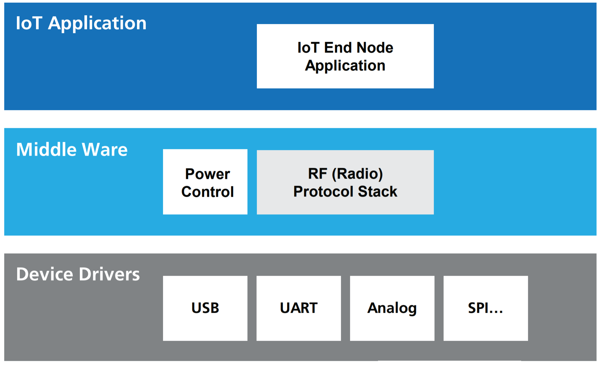
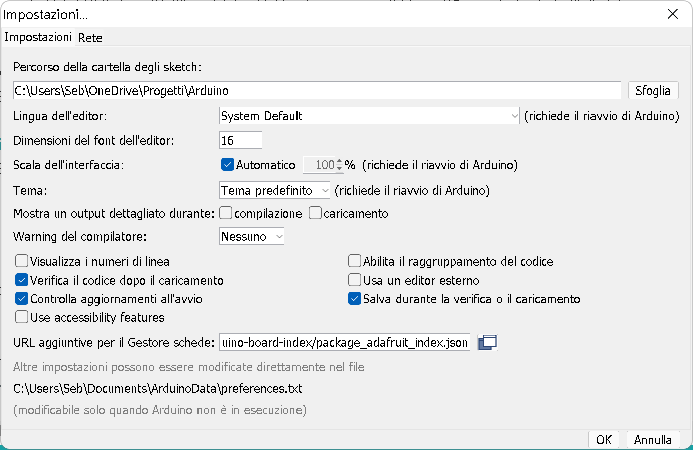
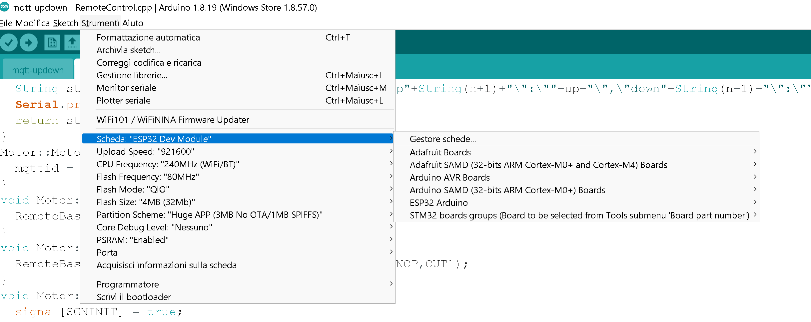
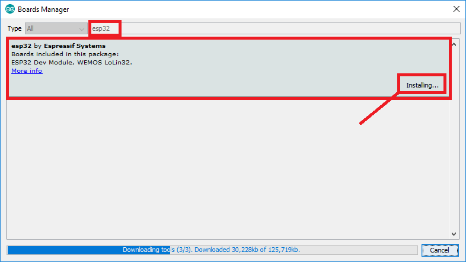

>[Torna all'indice generale](README.md)

### **Architettura di riferimento per IoT**

L'**architettura tipica del SW** a bordo di un dispositivo IoT è riassumibile:



Il **middleware** in genere è composto da **librerie di terze parti** da **compilare** all'interno di un **IDE** (ad es. Arduino) o all'interno di un **SDK** cioè un pacchetto di sviluppo per applicazioni che fornisce vari strumenti per compilazione, debug e documentazione (ad es. AWS IoT, Azure IoT, ESP-IDF). Oppure esistono **framework** specifici per IoT Open Source come RIOT che, una volta compilati su una macchina Linux, forniscono veri e propri **SO per IoT** con esattamente ciò che serve per la **comunicazione** di un certo dispositivo.

### **Librerie del progetto**

In questo caso gran parte delle funzioni del middleware, quelle relative alla comunicazione via stack LoRaWan, è implementato all'interno del sistema a microprocessore (MCU). Nello specifico, le funzioni di livello applicativo, che in ambito IoT, sono tutte quelle comprese tra il livello 2 e il livello 7 ISO/OSI sono compito della MCU mentre il livello fisico è realizzato in HW dal chip del modem.

L'installazione di SDK, loader e librerie in Arduino si può fare seguendo, nell'ordine, le seguenti fasi:
	1. installareo SDK **Arduino Core per Arduino_Core_STM32**. https://github.com/espressif/arduino-esp32. Per far ciò bisogna aggiungre alla fine della lista presente **"su url aggiuntive per il gestore schede"**: "https://dl.espressif.com/dl/package_esp32_index.json" che sitrova sul menu **File>Impostazioni**:



2. Andare su **strumenti>scheda/Arduino/Genuino Uno** librerie e installare la scheda  **ESP32**:






3. Selezionare la scheda **Lora Board**:


4. Andare su **strumenti/Board part number** librerie e selezionare il BSP (Arduino Board Support) **RAK811 Lora Tracker** 

5. Scaricare e installare STM32CubeIDE. Per poter utilizzare un STM32 con l'ambiente Arduino, si deve installare lo strumento STM32CubeIDE, che è disponibile al link https://www.st.com/en/development-tools/stm32cubeide.html.
6. In Strumenti > Metodo di caricamento: scegliere **STM32CubeProgrammer (SWD)**


### **Client MQTT per ESP32, ESP8266 e Arduino con metodo di connessione bloccante**

In questo caso le librerie che realizzano lo stack TCP/IP e il livello fisico del WiFi sono implementati all'interno del chip che svolge le funzioni di modem, oppure, come nel caso delle MCU ESP8266 e ESP32, sono librerie SW eseguite su un sottosistema HW della stessa MCU con funzioni specifiche di comunicazione. Nel caso della MCU ESP8266 lo stack TCP/IP è eseguito dallo stesso core e all'interno dello stesso thread dell'applicazione principale. Nel caso della MCU ESP832 lo stack TCP/IP è eseguito in un core a parte e in un thread privilegiato rispetto a quello dell'applicazione principale. Il core applicativo è comunque responsabile della comunicazione di livello applicativo realizzata dal protocollo MQTT.  

Utilizza la libreria **arduino-mqtt** scaricabille da https://github.com/256dpi/arduino-mqtt e adatta sia per esp8266 che per esp32. Ha la particolarità (comune a quasi tutte le librerie MQTT) di avere la **funzione di connessione bloccante**, per cui, se il server è momentaneamente indisponibile, il client rimane fermo sulla funzione di connessione senza ritornare. Scaduto un **timeout** la connect() **ritorna** permettendo al task che la contiene di continuare l'esecuzione. Nell'esempio seguente la connect() è dentro la callback di un timer HW ed è attivata da una ISR associata ad un interrupt. Le ISR, per definizione, dovrebbero essere non bloccanti perchè spesso non sono interrompibili. **Bloccare una ISR** collegata ad **eventi core** della macchina può causare **instabilità** che determinano il **reset** del sistema.

E' adoperabile sulle seguenti schede:

- Arduino Yun & Yun-Shield (Secure)
- Arduino Ethernet Shield
- Arduino WiFi Shield
- Adafruit HUZZAH ESP8266 (Secure)
- Arduino/Genuino WiFi101 Shield (Secure)
- Arduino MKR GSM 1400 (Secure)
- ESP32 Development Board (Secure)

In realtà, il task principale che contiene il loop() su **ESP32** apparentemente **non si blocca** probabilmente perchè sta su un thread diverso da quello in cui sta la connect MQTT (forse anche un'altro core della CPU rispetto a quello del loop()). Nel caso di una CPU single core come ESP8266 il codice potrebbe essere modificato inserendo nella callback del timer un **flag** al posto della connect e nel loop un **check del flag** che chiama la connect se questo è vero. In questo modo verrebbe bloccato solo il loop principale per qualche secondo, tempo in cui il sistema è non responsivo ma comunque funzionante. Oppure si potrebbe sostituire il timer HW che comanda la riconnessione periodica del client MQTT con un timer SW basato sul polling della millis() nel loop.

Le **librerie** vanno scaricate e scompattate dentro la cartella **libraries** all'interno della **cartella di lavoro** di Arduino. Le librerie da scaricare devono avere il nome (eventualmente rinominandole): 
- arduino-mqtt

Si tratta di una libreria **molto leggera** che non occupa spazio eccessivo in memoria istruzioni. 

Due **timer HW** ([Gestione dei tempi con i timer HW](timersched.md)) sono stati utilizzati in **combinazione** con gli **eventi**  **onConnection** e **onDisconnection** del **WiFi** (ma **non** del **MQTT** per il quale si usa il **polling** dello **stato**), per realizzare i **tentativi periodici** di **riconnessione** in **assenza** di connessione **WiFi** e in assenza di un server **MQTT** raggiungibile:
- **wifiReconnectTimer** è un timer che viene avviato in concomitanza di un evento di perdita di connessione del WiFi (SYSTEM_EVENT_STA_DISCONNECTED). Il timer viene attivato in modo **once**, cioè una sola volta. Alla sua **scadenza** parte la **funzione di riconnessione** del WiFi. Se essa va a **buon fine**, genera l'evento SYSTEM_EVENT_STA_GOT_IP (onConnection) che attiva il timer del **polling periodico dello stato MQTT** tramite l'istruzione **mqttReconnectTimer.attach_ms(...)**. Se invece la funzione di riconnessione del WiFi **non va a buon fine** essa genera l'evento SYSTEM_EVENT_STA_DISCONNECTED (onDisconnection) che riattiva il timer di riconnessione WiFi ancora per una **sola volta** tramite l'istruzione **wifiReconnectTimer.once_ms(...)**. La **combinazione** di callback e attivazione del timer di ritrasmissione WiFi genera periodicamente nuovi **tentativi di riconnessione** fintanto che la connessione WiFi è assente. In caso di **onDisconnection** del WiFi, l'istruzione  **mqttReconnectTimer.detach()** serve ad evitare che nuovi tentativi di polling della connessione MQTT vengano eseguiti durante i periodi di disservizio del WiFi dato che, in questo caso, il server MQTT sarebbe comunque irraggiungibile.
- **mqttReconnectTimer** sempre attivo **quando è presente il WiFi**, serve a fare il **polling** dello **stato** della connessione **MQTT** tramite **mqttClient.connected()**. Se MQTT **è connesso** (quando mqttClient.connected() in mqttConnTest() restituisce true) non accade nulla, altrimenti viene lanciato un nuovo tentativo di riconnessione tramite connectToMqtt().


```C++
//#include <WiFiClientSecure.h>
#include <WiFi.h>
#include <MQTT.h>
#include <Ticker.h>

#define WIFIRECONNECTIME  2000
#define MQTTRECONNECTIME  2000

Ticker mqttReconnectTimer;
Ticker wifiReconnectTimer;

const char ssid[] = "myssd";
const char pass[] = "mypsw";
const char mqttserver[] = "test.mosquitto.org";

//WiFiClientSecure net;
WiFiClient net;
MQTTClient mqttClient(1024);

unsigned long lastMillis = 0;
byte count = 0;

void messageReceived(String &topic, String &payload) {
  Serial.println("incoming: " + topic + " - " + payload);

  // Note: Do not use the client in the callback to publish, subscribe or
  // unsubscribe as it may cause deadlocks when other things arrive while
  // sending and receiving acknowledgments. Instead, change a global variable,
  // or push to a queue and handle it in the loop after calling `client.loop()`.
}

void WiFiEvent(WiFiEvent_t event) {
  Serial.printf("[WiFi-event] event: %d\n", event);
  switch(event) {
    case SYSTEM_EVENT_STA_GOT_IP:
      Serial.println("WiFi connected");
      Serial.println("IP address: ");
      Serial.println(WiFi.localIP());
      connectToMqtt();
      mqttReconnectTimer.attach_ms(MQTTRECONNECTIME, mqttConnTest);
      break;
    case SYSTEM_EVENT_STA_DISCONNECTED:
      Serial.println("WiFi lost connection");
      mqttReconnectTimer.detach(); // ensure we don't reconnect to MQTT while reconnecting to Wi-Fi
      wifiReconnectTimer.once_ms(WIFIRECONNECTIME, connectToWifi);
      break;
  }
}

void mqttConnTest() {
    if (!mqttClient.connected() && WiFi.status() == WL_CONNECTED) {
	Serial.print("MQTT lastError: ");
	Serial.println(mqttClient.lastError());
	connectToMqtt();
    }
}

void connectToWifi() {
  Serial.println("Connecting to Wi-Fi...");
  WiFi.mode(WIFI_STA);
  //WiFi.disconnect();
  WiFi.begin(ssid, pass);
}

void connectToMqtt() {
  Serial.println("Connecting to MQTT...");
  mqttClient.connect("bside2botham2", "try", "try");
  if(mqttClient.connected()){
	mqttClient.subscribe("/hello");
  }
  Serial.println("...end");
  // client.unsubscribe("/hello");
}

void setup() {
  Serial.begin(115200);
  WiFi.begin(ssid, pass);
  WiFi.onEvent(WiFiEvent);
  // MQTT brokers usually use port 8883 for secure connections.
  mqttClient.begin(mqttserver, 1883, net);
  mqttClient.onMessage(messageReceived); 
  connectToWifi();
  count = 0;
  while (WiFi.status() != WL_CONNECTED && count < 10) {
    delay(500);
    count++;
    Serial.print(".");
  }
}

void loop() {
  mqttClient.loop();
  //delay(10);  // <- fixes some issues with WiFi stability

  // publish a message roughly every 2 second.
  if (millis() - lastMillis > 2000) {
        lastMillis = millis();
	
	Serial.println("Tick");
	// pubblicazione periodica di test
        mqttClient.publish("/hello", "world");
  }
}

/*
WL_CONNECTED: assigned when connected to a WiFi network;
WL_NO_SHIELD: assigned when no WiFi shield is present;
WL_IDLE_STATUS: it is a temporary status assigned when WiFi.begin() is called and remains active until the number of attempts expires (resulting in WL_CONNECT_FAILED) or a connection is established (resulting in WL_CONNECTED);
WL_NO_SSID_AVAIL: assigned when no SSID are available;
WL_SCAN_COMPLETED: assigned when the scan networks is completed;
WL_CONNECT_FAILED: assigned when the connection fails for all the attempts;
WL_CONNECTION_LOST: assigned when the connection is lost;
WL_DISCONNECTED: assigned when disconnected from a network;
\*/
```

Per dettagli ulteriori sui gateway MQTT e per esplorare l'utilizzo di altre librerie per esp32 sempre programmabili mediante con l'IDE di Arduino vedere:
- https://github.com/sebastianomelita/ArduinoBareMetal/blob/master/gateway.md
- https://www.instructables.com/Installing-the-ESP32-Board-in-Arduino-IDE-Windows-/

>[Torna all'indice generale](README.md)
