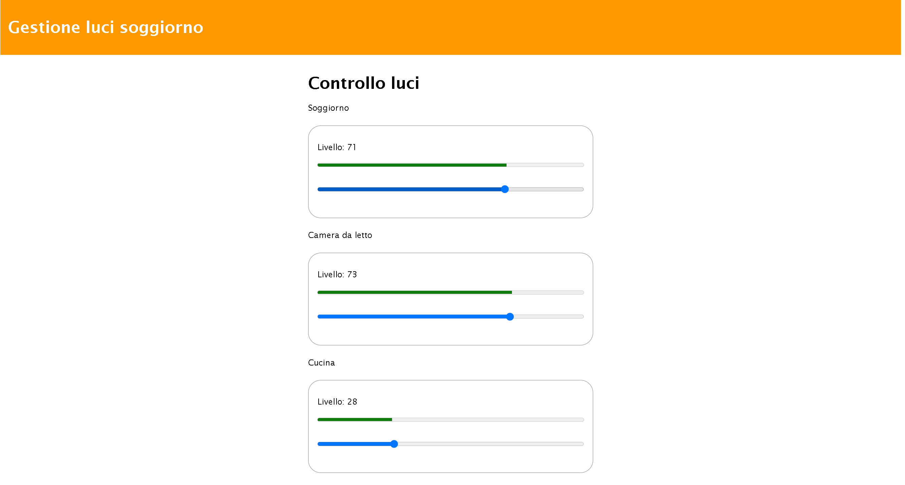

>[Torna all'indice generale](../README.md)

# **COMANDO SLIDER**

### **Utilizzo**

La pagina ha **4 slider** divisi in **4 gruppi**. Un gruppo comanda l'impostazione del livello di una singola uscita. Le uscite **non** sono direttamente **impostate** dalla libreria perchè sono lasciate volutamente **generiche** in quanto potrebbero attivare, a seconda dei casi, una porta digitale, un comando MODBUS, un comando sulla seriale, ecc.


Fasi:
- **Trascinando** un qualsiasi **slider** l'uscita viene impostata ad un valore compreso tra ```0``` e ```100```. Il valore però non viene inviato al dispositivo durante il trascinamento ma solamente dopo che il cursore si è fermato ed il click del mouse è stato rilasciato.


### **Layout pagina**

La **pagina** ```mqttupdown.html``` può essere caricata sul browser da una cartella sul PC o può essere caricata su un server web di pagine statiche.

Il **layout** è statico, responsivo, diviso in colonne ed è definito mediante il seguente CSS di **tipo GRID**:

```css
<style>
	.grid-container {
		display: grid;
		grid-template-columns: 1fr;
	}

	table {
		width: 100%;
	}

	@media only screen and (min-width: 600px) {
	  /* For tablets: */
	  .grid-container {
		  grid-template-columns: 1fr 1fr 1fr 1fr 1fr 1fr 1fr 1fr 1fr 1fr 1fr 1fr;
	  }
	  .col-s-1 {grid-column: span 1;}
	  .col-s-2 {grid-column: span 2;}
	  .col-s-3 {grid-column: span 3;}
	  .col-s-4 {grid-column: span 4;}
	  .col-s-5 {grid-column: span 5;}
	  .col-s-6 {grid-column: span 6;}
	  .col-s-7 {grid-column: span 7;}
	  .col-s-8 {grid-column: span 8;}
	  .col-s-9 {grid-column: span 9;}
	  .col-s-10 {grid-column: span 10;}
	  .col-s-11 {grid-column: span 11;}
	  .col-s-12 {grid-column: span 12;}
	}

	@media only screen and (min-width: 768px) {
	  /* For desktop: */
	  .grid-container {
		  grid-template-columns: 1fr 1fr 1fr 1fr 1fr 1fr 1fr 1fr 1fr 1fr 1fr 1fr;
	  }
	  .col-1 {grid-column: span 1;}
	  .col-2 {grid-column: span 2;}
	  .col-3 {grid-column: span 3;}
	  .col-4 {grid-column: span 4;}
	  .col-5 {grid-column: span 5;}
	  .col-6 {grid-column: span 6;}
	  .col-7 {grid-column: span 7;}
	  .col-8 {grid-column: span 8;}
	  .col-9 {grid-column: span 9;}
	  .col-10 {grid-column: span 10;}
	  .col-11 {grid-column: span 11;}
	  .col-12 {grid-column: span 12;}
	}
	.luci{
		border: 1px solid black;
	}
</style>
```



### **Struttura HTML**

La **pagina statica** ha tre sezioni una sotto l'altra:
- un **header** con il titolo e le informazioni comuni alla pagina da visualizzare per prima.
- un **corpo** organizzato mediante un layout a colonne responsive di tipo grid che contiene gli elementi HTML di **comando** con gli input e le informazioni di output.
- un **footer**. che contiene informazioni generali da visualizzare per ultime.

La definizione della **gerarchia di elementi** contenitori e contenuti del corpo dei comandi:

```html
<div class="header">
  <h1>Gestione luci soggiorno</h1>
</div>
<div class="grid-container">
	<div class="col-4 col-s-3 menu">
	</div>
	<div class="col-4 col-s-9 menu">
	 <h1>Controllo luci</h1>
	 <div id='form'>
		<form>
			<label for='rng1'>Soggiorno<label>
		    <div class="boxed">
				<p>Livello: <span id='val1'></span></p>
				<meter id='pr1' min='0' max='100' style='width:100%; clear:both; margin:0 auto'>></meter>
				<br>
				<input type='range' min='0' max='100' value='50' list='tickmarks' class='slider' id='rng1'>
			</div>
			<label for='rng2'>Camera da letto<label>
			<div class="boxed">
				<p>Livello: <span id='val2'></span></p>
				<meter id='pr2' min='0' max='100' style='width:100%; clear:both; margin:0 auto'>></meter>
				<br>
				<input type='range' min='0' max='100' value='50' list='tickmarks' class='slider' id='rng2'>
			</div>
			<label for='rng3'>Cucina<label>
			<div class="boxed">
				<p>Livello: <span id='val3'></span></p>
				<meter id='pr3' min='0' max='100' style='width:100%; clear:both; margin:0 auto'>></meter>
				<br>
				<input type='range' min='0' max='100' value='50' list='tickmarks' class='slider' id='rng3'>
			</div>
			<label for='rng4'>Bagno<label>
			<div class="boxed">
				<p>Livello: <span id='val4'></span></p>
				<meter id='pr4' min='0' max='100' style='width:100%; clear:both; margin:0 auto'>></meter>
				<br>
				<input type='range' min='0' max='100' value='50' list='tickmarks' class='slider' id='rng4'>
			</div>
		</form>
	 </div>
	</div>
	<div class="col-3 col-s-12">
	</div>
</div>
<div class="footer">
	  <p>Resize the browser window to see how the content respond to the resizing.</p>
</div>
```

### **Formato JSON ingressi**

```C++
buf {"devid":"soggiorno-gruppo06","pr1":"71"}
buf {"devid":"soggiorno-gruppo06","pr2":"73"}
buf {"devid":"soggiorno-gruppo06","pr3":"28"}
buf {"devid":"soggiorno-gruppo06","pr4":"0"}
```

### **Callback uscite**

- ```outr```. Stato del pulsante in percentuale. Valore ```0``` o ```100``` 
- ```cr```. Stato del pulsante. Valore ```0``` o ```NLEVEL``` 
- ```n```. Numero del pulsante (inizia da 0).

```C++
void sldAction(int outr, int cr, uint8_t n){
	Serial.println("Out " + String(n) + " - cr: " +  String(cr)+ " - n: " +  String(n));
	ledcWrite(n, cr);
};
```

### **Formato JSON feedback**

```C++
buf {"devid":"soggiorno-gruppo06","to1":"1"}
buf {"devid":"soggiorno-gruppo06","to2":"1"}
buf {"devid":"soggiorno-gruppo06","to3":"0"}
buf {"devid":"soggiorno-gruppo06","to4":"1"}
```
### **Metodi di base comuni a tutti gli oggetti IOT**

- ```cmdParser(str,payload,"cmd",MAXLEN)```. Ricerca un certo commando ```cmd``` all’interno di una stringa e ne restituisce il valore sotto forma di stringa sul parametro di out str. Ritorna ```true``` se ha trovato un'occorenza del comando, ```false``` altrimenti.
- ```processCmd(String id, String payload)```. Elabora la richiesta remota interpretando la stringa json del messaggio in base al tipo di dispositivo IOT.

### **Metodi specifici di Slider**

- ```Slider(String id, uint8_t startIndex, unsigned nlevels)```. Costruttore. P1: devid univoco, P2: indice dispositivo nel gruppo (0,1,2,...), P3: numero di livelli da valorizzare
- ```remoteSlider(uint8_t targetval)```. imposta il valore coorente dello slider. Valori da ```0``` a ```100```.
- ```onAction(SweepCallbackSimple cb)```. Definisce la callback delle azioni esterne.

### **Struttura sketch Arduino**

Lo **sketch** ```mqtt-toggle.ino``` deve essere aperto con l'IDE di Arduino e caricato sul dispositivo ESP32 dopo aver selezionato correttamente la scheda e la porta della seriale e, chiaramente, dopo aver connesso il dispositivo alla porta usb del PC.

- ```id```. Nome univoco MQTT del dispositivo (uguale per tutti i pulsanti del gruppo.
- ```startIndex```. Nome univoco MQTT del dispositivo (uguale per tutti i pulsanti del gruppo.
- ```nlevels```. Numero di livelli che valorizza lo slider.

```C++
Slider(String id, uint8_t startIndex, unsigned nlevels)
```


```C++
Slider sld1(mqttid,0,NLEVEL1);
Slider sld2(mqttid,1,NLEVEL2);
Slider sld3(mqttid,2,NLEVEL3);
Slider sld4(mqttid,3,NLEVEL4);

void setup() {
	sld1.onAction(sldAction);
	sld2.onAction(sldAction);
	sld3.onAction(sldAction);
	sld4.onAction(sldAction);
	sld1.onFeedback(feedbackAction);
	sld2.onFeedback(feedbackAction);
	sld3.onFeedback(feedbackAction);
	sld4.onFeedback(feedbackAction);
	.........................
	mqttClient.onMessage(messageReceived); 
}

void loop() {
	mqttClient.loop();
	//delay(10);  // <- fixes some issues with WiFi stability
	sld1.remoteCntrlEventsParser();
	sld2.remoteCntrlEventsParser();
	sld3.remoteCntrlEventsParser();
	sld4.remoteCntrlEventsParser();
	// schedulatore eventi dispositivo
	// pubblica lo stato dei pulsanti dopo un minuto
	if (millis() - lastMillis > STATEPERIOD) {
		lastMillis = millis();
		
		if(mqttClient.connected()){
			Serial.println("Ritrasm. periodica stato: ");
			sld1.remoteConf();
			sld2.remoteConf();
			sld3.remoteConf();
			sld4.remoteConf();
		}
	}
}

void sldAction(int outr, int cr, uint8_t n){
	Serial.println("Out " + String(n) + " - cr: " +  String(cr)+ " - n: " +  String(n));
	ledcWrite(n, cr);
};
void feedbackAction(String buf){
	Serial.println("buf " + buf);
	mqttClient.publish(outtopic, buf);
};
void messageReceived(String &topic, String &payload) {
	Serial.println("incoming: " + topic + " - " + payload);
	// Note: Do not use the client in the callback to publish, subscribe or
	// unsubscribe as it may cause deadlocks when other things arrive while
	// sending and receiving acknowledgments. Instead, change a global variable,
	// or push to a queue and handle it in the loop after calling `client.loop()`.
	
	//if(topic == intopic){
		//String str;	
		sld1.processCmd(mqttid, payload, MAXLEN);
		sld2.processCmd(mqttid, payload, MAXLEN);
		sld3.processCmd(mqttid, payload, MAXLEN);
		sld4.processCmd(mqttid, payload, MAXLEN);
	//}
};
```

### **Callback MQTT corta**

```C++
void messageReceived(String &topic, String &payload) {
	Serial.println("incoming: " + topic + " - " + payload);
	// Note: Do not use the client in the callback to publish, subscribe or
	// unsubscribe as it may cause deadlocks when other things arrive while
	// sending and receiving acknowledgments. Instead, change a global variable,
	// or push to a queue and handle it in the loop after calling `client.loop()`.
	
	//if(topic == intopic){
		sld1.processCmd(mqttid, payload, MAXLEN);
		sld2.processCmd(mqttid, payload, MAXLEN);
		sld3.processCmd(mqttid, payload, MAXLEN);
		sld4.processCmd(mqttid, payload, MAXLEN);
	//}
};
```
    

### **Callback MQTT lunga**

```C++
/////// gestore messaggi MQTT in ricezione (callback)     
void messageReceived(String &topic, String &payload) {
	Serial.println("incoming: " + topic + " - " + payload);
	// Note: Do not use the client in the callback to publish, subscribe or
	// unsubscribe as it may cause deadlocks when other things arrive while
	// sending and receiving acknowledgments. Instead, change a global variable,
	// or push to a queue and handle it in the loop after calling `client.loop()`.
	
	//if(topic == intopic){
		String str;		
		// COMMANDS PARSER /////////////////////////////////////////////////////////////////////////////////////////////
		// ricerca all'interno del payload l'eventuale occorrenza di un comando presente in un set predefinito 
		////////////////////////////////////////////////////////////////////////////////////////////////////////////////
		sld1.cmdParser(str,payload,"devid",MAXLEN);
		if(str == mqttid){		
		    if(sld1.cmdParser(str,payload,"sld1",MAXLEN)){
				sld1.remoteSlider(atoi(str.c_str()));
			}
			if(sld2.cmdParser(str,payload,"sld2",MAXLEN)){
				sld2.remoteSlider(atoi(str.c_str()));
			}
			if(sld3.cmdParser(str,payload,"sld3",MAXLEN)){
				sld3.remoteSlider(atoi(str.c_str()));
			}
			if(sld4.cmdParser(str,payload,"sld4",MAXLEN)){
				sld4.remoteSlider(atoi(str.c_str()));
			}
			if(payload.indexOf("\"conf\":\"255\"") >= 0){
				sld1.remoteConf();
				sld2.remoteConf();
				sld3.remoteConf();
				sld4.remoteConf();
			}
		}
};
```

>[Torna all'indice generale](../README.md)
