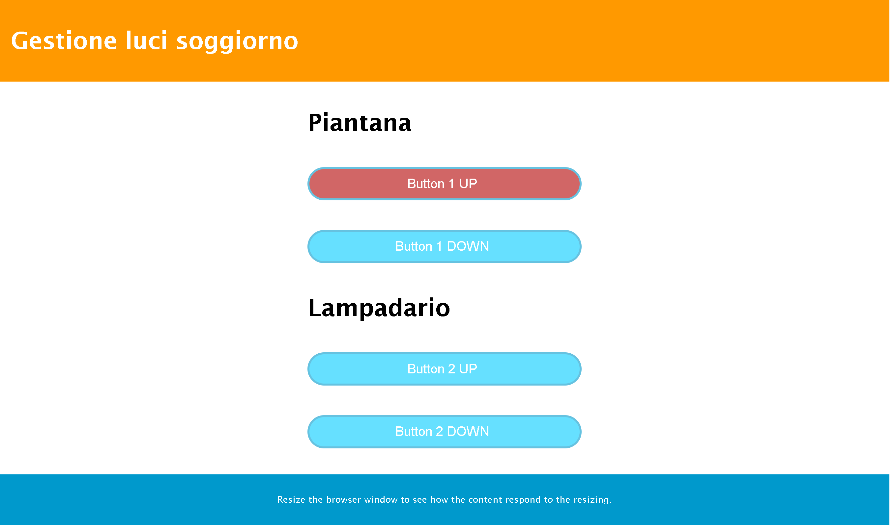

>[Torna all'indice generale](../README.md)

# **COMANDO UP DOWN MOTORE**

### **Layout pagina**


La **pagina** ```mqttupdown.html``` può essere caricata sul browser da una cartella sul PC o può essere caricata su un server web di pagine statiche.

Il layout è statico ed è definito mediante il seguente CSS di tipo GRID:

```css
<style>
	.grid-container {
		display: grid;
		grid-template-columns: 1fr;
	}

	table {
		width: 100%;
	}

	@media only screen and (min-width: 600px) {
	  /* For tablets: */
	  .grid-container {
		  grid-template-columns: 1fr 1fr 1fr 1fr 1fr 1fr 1fr 1fr 1fr 1fr 1fr 1fr;
	  }
	  .col-s-1 {grid-column: span 1;}
	  .col-s-2 {grid-column: span 2;}
	  .col-s-3 {grid-column: span 3;}
	  .col-s-4 {grid-column: span 4;}
	  .col-s-5 {grid-column: span 5;}
	  .col-s-6 {grid-column: span 6;}
	  .col-s-7 {grid-column: span 7;}
	  .col-s-8 {grid-column: span 8;}
	  .col-s-9 {grid-column: span 9;}
	  .col-s-10 {grid-column: span 10;}
	  .col-s-11 {grid-column: span 11;}
	  .col-s-12 {grid-column: span 12;}
	}

	@media only screen and (min-width: 768px) {
	  /* For desktop: */
	  .grid-container {
		  grid-template-columns: 1fr 1fr 1fr 1fr 1fr 1fr 1fr 1fr 1fr 1fr 1fr 1fr;
	  }
	  .col-1 {grid-column: span 1;}
	  .col-2 {grid-column: span 2;}
	  .col-3 {grid-column: span 3;}
	  .col-4 {grid-column: span 4;}
	  .col-5 {grid-column: span 5;}
	  .col-6 {grid-column: span 6;}
	  .col-7 {grid-column: span 7;}
	  .col-8 {grid-column: span 8;}
	  .col-9 {grid-column: span 9;}
	  .col-10 {grid-column: span 10;}
	  .col-11 {grid-column: span 11;}
	  .col-12 {grid-column: span 12;}
	}
	.luci{
		border: 1px solid black;
	}
</style>
```



### **Struttura HTML**


```html
<div class="header">
	 <h1>Gestione luci soggiorno</h1>
</div>
<div class="grid-container">
	<div class="col-4 col-s-3 menu">
	</div>
	<div class="col-4 col-s-9 menu">
	<h1>Piantana</h1>
	<div id='form'>
		<form>
			<input id='up1' type='button' value='Button 1 UP' onmousedown='this.style.opacity="1"' onmouseup='this.style.opacity="0.6"' ontouchstart='this.style.opacity="1"' ontouchend='this.style.opacity="0.6"'>
			<br>
			<input id='down1' type='button' value='Button 1 DOWN' onmousedown='this.style.opacity="1"' onmouseup='this.style.opacity="0.6"' ontouchstart='this.style.opacity="1"' ontouchend='this.style.opacity="0.6"'>
			<br>
			<h1>Lampadario</h1>
			<input id='up2' type='button' value='Button 2 UP'  onmousedown='this.style.opacity="1"' onmouseup='this.style.opacity="0.6"' ontouchstart='this.style.opacity="1"' ontouchend='this.style.opacity="0.6"'>
			<br>
			<input id='down2' type='button' value='Button 2 DOWN' onmousedown='this.style.opacity="1"' onmouseup='this.style.opacity="0.6"' ontouchstart='this.style.opacity="1"' ontouchend='this.style.opacity="0.6"'>
			<br>
		</form>
	 </div>
	</div>
	<div class="col-4 col-s-12">
	</div>
</div>
<div class="footer">
	  <p>Resize the browser window to see how the content respond to the resizing.</p>
</div>
```

### **Formato JSON ingressi**

```C++
{"devid":"soggiorno-gruppo06","up1":"255"}
{"devid":"soggiorno-gruppo06","down1":"255"}

```

### **Formato JSON feedback**

```C++
{"devid":"soggiorno-gruppo06","up1":"255","down1":"0","dr1":"1"}
{"devid":"soggiorno-gruppo06","up1":"0","down1":"255","dr1":"-1"}
{"devid":"soggiorno-gruppo06","up2":"0","down2":"0","dr2":"0"}
```
### **Metodi di base comuni a tutti gli oggetti IOT**

- ```cmdParser(str,payload,"cmd",MAXLEN)```. Ricerca un certo commando ```cmd``` all’interno di una stringa e ne restituisce il valore sotto forma di stringa sul parametro di out str. Ritorna ```true``` se ha trovato un'occorenza del comando, ```false``` altrimenti.
- ```processCmd(String id, String payload)```. Elabora la richiesta remota interpretando la stringa json del messaggio in base al tipo di dispositivo IOT.

### **Metodi specifici di Motor**

- ```Motor(String id, uint8_t startIndex)```. Costruttore. P1: devid univoco, P2: indice dispositivo nel gruppo (0,1,2,...)
- ```remoteCntrlUp(void)```. Pulsante marcia avanti, attiva il motore nella direzione 1 se il motore è fermo, lo blocca se il motore è in marcia.
- ```remoteCntrlDown(void)```. Pulsante marcia indietro, attiva il motore nella direzione -1 se il motore è fermo, lo blocca se il motore è in marcia.
- ```remoteConf(void)```. Interroga lo stato corrente del dispositivo.
- ```remoteCntrlEventsParser()```. Genratore di eventi di feedback ed azioni esterne a partire da ingressi e stato corrente.
- ```onAction(SweepCallbackSimple cb)```. Definisce la callback delle azioni esterne.

### **Struttura sketch Arduino**

Lo **sketch** ```mqttt-updown.ino``` deve essere aperto con l'IDE di Arduino e caricato sul dispositivo ESP32 dopo aver selezionato correttamente la scheda e la porta della seriale e, chiaramente, dopo aver connesso il dispositivo alla porta usb del PC.

```C++
Motor m1(mqttid,0);

void setup() {
	//inizializza la coda con il valore 0 su tutte le celle
	m1.onFeedback(feedbackAction);
	m1.onAction(motorAction1);
	.........................
	mqttClient.onMessage(messageReceived); 
}

void loop() {
	mqttClient.loop();
	//delay(10);  // <- fixes some issues with WiFi stability
	m1.remoteCntrlEventsParser();
	// schedulatore eventi dispositivo
	// pubblica lo stato dei pulsanti dopo un minuto
	if (millis() - lastMillis > STATEPERIOD) {
		lastMillis = millis();
		
		if(mqttClient.connected()){
			Serial.println("Ritrasm. periodica stato: ");
			m1.remoteConf();
		}
	}
}

void feedbackAction(String buf){
	mqttClient.publish(outtopic, buf);
};
void motorAction1(int enabled, int dir, uint8_t n){
	Serial.println("Enabled " + String(enabled) + " - dir: " +  String(dir)+ " - n: " +  String(n));
};
void messageReceived(String &topic, String &payload) {
	Serial.println("incoming: " + topic + " - " + payload);
	// Note: Do not use the client in the callback to publish, subscribe or
	// unsubscribe as it may cause deadlocks when other things arrive while
	// sending and receiving acknowledgments. Instead, change a global variable,
	// or push to a queue and handle it in the loop after calling `client.loop()`.
	
	if(topic == intopic){
		m1.processCmd(mqttid, payload, MAXLEN);
		m2.processCmd(mqttid, payload, MAXLEN);
	}
};
```

### **Callback MQTT corta**

```C++
void messageReceived(String &topic, String &payload) {
	Serial.println("incoming: " + topic + " - " + payload);
	// Note: Do not use the client in the callback to publish, subscribe or
	// unsubscribe as it may cause deadlocks when other things arrive while
	// sending and receiving acknowledgments. Instead, change a global variable,
	// or push to a queue and handle it in the loop after calling `client.loop()`.
	
	//if(topic == intopic){
		m1.processCmd(mqttid, payload, MAXLEN);
	//}
};
```
    

### **Callback MQTT lunga**

```C++
/////// gestore messaggi MQTT in ricezione (callback)     
void messageReceived(String &topic, String &payload) {
	Serial.println("incoming: " + topic + " - " + payload);
	// Note: Do not use the client in the callback to publish, subscribe or
	// unsubscribe as it may cause deadlocks when other things arrive while
	// sending and receiving acknowledgments. Instead, change a global variable,
	// or push to a queue and handle it in the loop after calling `client.loop()`.
	
	//if(topic == intopic){
		String str;	
		// COMMANDS PARSER /////////////////////////////////////////////////////////////////////////////////////////////
		// ricerca all'interno del payload l'eventuale occorrenza di un comando presente in un set predefinito 
		////////////////////////////////////////////////////////////////////////////////////////////////////////////////
		m1.cmdParser(str,payload,"devid",MAXLEN);
		if(str == mqttid){		
		    if(m1.cmdParser(str,payload,"up1",MAXLEN)){
				m1.remoteCntrlUp();
			}
			if(m1.cmdParser(str,payload,"down1",MAXLEN)){
				m1.remoteCntrlDown();
			}
			if(m2.cmdParser(str,payload,"up2",MAXLEN)){
				m2.remoteCntrlUp();
			}
			if(m2.cmdParser(str,payload,"down2",MAXLEN)){
				m2.remoteCntrlDown();
			}
			if(payload.indexOf("\"conf\":\"255\"") >= 0){
				m1.remoteConf();
				m2.remoteConf();
			}
		}
	//}
};
```

>[Torna all'indice generale](../README.md)
