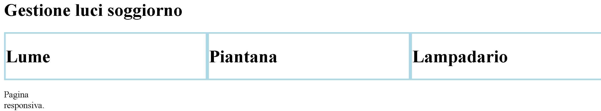

>[Torna all'indice generale](README.md)


### **Pagine responsive**

Il **design responsivo**, o responsive web design (RWD), indica una tecnica di web design per la realizzazione di siti in grado di **adattarsi graficamente** in modo automatico al dispositivo coi quali vengono visualizzati (computer con diverse risoluzioni, tablet, smartphone, cellulari, web tv), riducendo al minimo la necessità dell'utente di ridimensionare e scorrere i contenuti.

**Media query**

Esempio resptest.html

Le **Media Queries** (conosciute anche come Media Query) sono dichiarazioni CSS con le quali è possibile identificare il tipo di dispositivo o una sua caratteristica allo scopo di applicare stili o condizioni differenti in base ad un elenco di regole.

```CSS
<html>
<head>
<meta name="viewport" content="width=device-width, initial-scale=1.0">
<style>
body {
  background-color: yellow;
}

@media only screen and (min-width: 600px) {
  body {
    background-color: lightblue;
  }
}

@media only screen and (min-width: 768px) {
  body {
    background-color: red;
  }
}
</style>
</head>
<body>

<h1>The @media Rule</h1>

</body>
</html>
  ```
  [resptest.html]( https://sebastianomelita.github.io/simple-mqtt-esp32-object-IoTFramework/resptest.html)
 

### **Grid layout**

Il **layout grid** è un layout regolare che riproduce una schema grafico **tabellare** partendo da un **elemento contenitore** (di solito un div) che possiede al suo interno uno o più **elementi figli** (di solito altri div).

La definizione della gerarchia di contenitori e contenuti si fa nel **HTML** tramite:

```html
div class="grid-container">
	<div class="col-4 col-s-3 luci"><h1>Lume</h1></div>
	<div class="col-4 col-s-9 luci"><h1>Piantana</h1></div>
	<div class="col-4 col-s-12 luci"><h1>Lampadario</h1</div>
</div>
```
La definizione dello schema grafico si fa nel **CSS** tramite:

```css
.grid-container {
	display: grid;
	grid-template-columns: 1fr;
}
```
che definisce una **griglia** che possiede un numero imprecisato di righe ma esattamente **una sola colonna** di dimensione 1fr cioè una parte di tutto lo spazio disponibile. 

Mentre 
```css
.grid-container {
		  grid-template-columns: 1fr 1fr 1fr 1fr 1fr 1fr 1fr 1fr 1fr 1fr 1fr 1fr;
	  }
```
definisce una **griglia** che possiede un numero imprecisato di righe ma esattamente **dodici colonne** di 1fr cioè di una parte delle dodici parti in cui è diviso lo spazio disponibile. Le parti sono ovviamente tutte di **ugual dimensione**.

### **Dimensioni discretizzate**

In **ambito web**, ormai da molti anni, è prassi consolidata **non** disporre gli oggetti in orrizzontale in **posizioni arbitrarie** ma semplificare la progettazione del layout scegliendo una **posizione fissa** tra un numero massimo. Di solito **dodici** è ritenuto il numero di colonne che massimo che si riesce a gestire con sufficiente comodità. Infatti questa è la soluzione adottata dalla magggior parte dei **framework CSS** utilizzati per il teamplating della pagine, uno fra tutti **Bootstrap**.

Ne deriva che la **dimensione minima** orizzontale (ampiezza) di un oggetto html è di almeno ```1/12``` dello spazio orizzontale disponibile. 

Ma quanto vale la **larghezza massima**? Quella è ovviamente tutto lo spazio disponibile visto come un'unica colonna. 

Ma allora è possibile definire oggetti di **dimensione intermedia** tra ```1/12``` e tutto lo spazio disponibile? La risposta è si a patto che la dimensione di un generico oggetto sia sempre un **multiplo intero** della dimensione minima cioè ```1/12```. 

Quindi, in definitiva, sono possibili **12 dimensioni** che variano nell'intervallo ```1/12, 2/12, 3/12,....12/12=tutto```.

### **Dichiarazione span**

La parola chiave CSS ```span``` permette di definire efficacemente la dimensione di un elemento HTML a partire dalla sua posizione iniziale per un certo numero di colonne della griglia definite dal numero che segue ```span```. La posizione iniziale dell'elemento è relativa  al margine destro dell'elemento che lo precede e quindi, dalla sua larghezza. Lo stesso per tutti quelli che lo precedono.

In sostanza, creo il primo mattoncino a partire dalll'estremo margine sinistro e lo spalmo sulla riga corrente per un certo numero di colonne dato dal qualificatore ```span```, subito dopo spalmo il secondo mattoncino per un altro numero di colonne stabilito dal suo qualificatore ```span```, e così per i mattoncini a seguire.

Se il numero complessivo delle colonne di tutti i mattoncini è minore di 12 allora tutti i mattoncini stanno su una sola riga, aòtrimenti le colonne che superano la dodicesima andranno a capo e troveranno posto nella riga a seguire. Così per tutte le righe.

Il **passo successivo** è etichettare tutti mattoncini con un **selettore di classe** in modo da poterci allocare un generico **elemento HTML** assegnadolo alla classe del mattoncino di dimensione voluta.

Ad esempio:

```.col-1 {grid-column: span 1;}``` è una dichiarazione CSS che attribuisce agli elementi della classe .col-1 la dimensione di un sola colonna. 

```.col-2 {grid-column: span 2;}``` è una dichiarazione CSS che attribuisce agli elementi della classe .col-2 la dimensione di due colonne. 


### **Griglie responsive**

nella pratica si preferisce definire un certo numero di grid layout uguali nella struttura ma con mattoncini di **nome diverso**. I mattoncini di griglie diverse saranno utilizzati per **risoluzioni diverse** dello schermo del dispositivo che li visualizza. Per ogni risoluzione si progetta un layout più appropriato:
- Le risoluzioni maggiori possono permettersi di spalmare gli elementi HTML su molte colonne (al limite tutte e 12). 
- Quelli con risoluzione più bassa cercheranno di ottimizzare la visualizzazione allocando gli elementi HTML su poche colonne (al limite solo una).

Normalmante la risoluzione di **default** è la minima con una griglia di una sola colonna. Poi si definisce una **risoluzione normale** per schermi grandi e per finire si definisce una risoluzione **small** per schermi intermedi. Per le basse riaoluzioni degli schermi molto piccoli si usa la griglia di default.

La classi delle griglie small si distinguono da quelle normali avendo l'accortezza di inserire il **suffisso s** al loro interno. Ad esempio:
```".col-4 .col-s-8"``` rappresenta un elemento HTML in 4 colonne negli schermi grandi e in 8 colonne in quelli piccoli.

```html
<div class="col-4 col-s-8 luci">
```

**ATTENZIONE**. Per evitare di mandare a capo gli elementi che si desiderano stiano in una **stessa riga** è un **requisito essenziale** che la **somma complessiva** delle ampiezze degli elementi HTML che devono stare in **quella riga** sia esattamente 12. Non una colonna in meno ma neppure una in più.

Esempio ```soggiorno.html```

Si vuole una **pagina responsiva** che per **schermi grandi** deve avere il seguente layout di **tre colonne** per 3 elementi HTML (in questo caso un div) tutti disposti in una stessa riga (somma 12). 

Per **schermi intermedi** deve avere un layout di 2 righe in cui la prima deve contenere solo due elementi rispettivamente di 3 colonne e di 9 colonne (somma 12), mentre la seconda riga deve contenere un solo elemento che quindi occuperà tutte e 12 le colonne a disposizione.

Per **schermi molto piccoli** vale il **layout di default** monocolonna per ciascun elemento che quindi verranno allocati complessivamente su 3 righe.

In definitiva:

```html
<div class="grid-container">
	<div class="col-4 col-s-3 luci"><h1>Lume</h1></div>
	<div class="col-4 col-s-9 luci"><h1>Piantana</h1></div>
	<div class="col-4 col-s-12 luci"><h1>Lampadario</h1</div>
</div>
```



```html
<!DOCTYPE html>
<html>
<head>
<style>
	.grid-container {
		display: grid;
		grid-template-columns: 1fr;
	}

	table {
		width: 100%;
	}

	@media only screen and (min-width: 600px) {
	  /* For tablets: */
	  .grid-container {
		  grid-template-columns: 1fr 1fr 1fr 1fr 1fr 1fr 1fr 1fr 1fr 1fr 1fr 1fr;
	  }
	  .col-s-1 {grid-column: span 1;}
	  .col-s-2 {grid-column: span 2;}
	  .col-s-3 {grid-column: span 3;}
	  .col-s-4 {grid-column: span 4;}
	  .col-s-5 {grid-column: span 5;}
	  .col-s-6 {grid-column: span 6;}
	  .col-s-7 {grid-column: span 7;}
	  .col-s-8 {grid-column: span 8;}
	  .col-s-9 {grid-column: span 9;}
	  .col-s-10 {grid-column: span 10;}
	  .col-s-11 {grid-column: span 11;}
	  .col-s-12 {grid-column: span 12;}
	}

	@media only screen and (min-width: 768px) {
	  /* For desktop: */
	  .grid-container {
		  grid-template-columns: 1fr 1fr 1fr 1fr 1fr 1fr 1fr 1fr 1fr 1fr 1fr 1fr;
	  }
	  .col-1 {grid-column: span 1;}
	  .col-2 {grid-column: span 2;}
	  .col-3 {grid-column: span 3;}
	  .col-4 {grid-column: span 4;}
	  .col-5 {grid-column: span 5;}
	  .col-6 {grid-column: span 6;}
	  .col-7 {grid-column: span 7;}
	  .col-8 {grid-column: span 8;}
	  .col-9 {grid-column: span 9;}
	  .col-10 {grid-column: span 10;}
	  .col-11 {grid-column: span 11;}
	  .col-12 {grid-column: span 12;}
	}
	.luci{
		border: 1px solid black;
	}
</style>
</head>
<body>	
	<div class="header"><h1>Gestione luci soggiorno</h1></div>
	<div class="grid-container">
		<div class="col-4 col-s-3 luci"><h1>Lume</h1></div>
		<div class="col-4 col-s-9 luci"><h1>Piantana</h1></div>
		<div class="col-4 col-s-12 luci"><h1>Lampadario</h1</div>
	</div>
	<div class="footer"><p>Pagina responsiva.</p>
	</div>
</html>
```
[soggiorno.html](https://sebastianomelita.github.io/simple-mqtt-esp32-object-IoTFramework/soggiorno.html)


Lo spazio in questo contesto conviene misurarlo in unità frazionarie, dove 1fr rappresenta una parte dello spazio disponibile. 

**Sitografia:**
- https://www.4next.eu/news/mqtt-capitolo-2/
- https://it.wikipedia.org/wiki/Design_responsivo

>[Torna all'indice generale](README.md)
